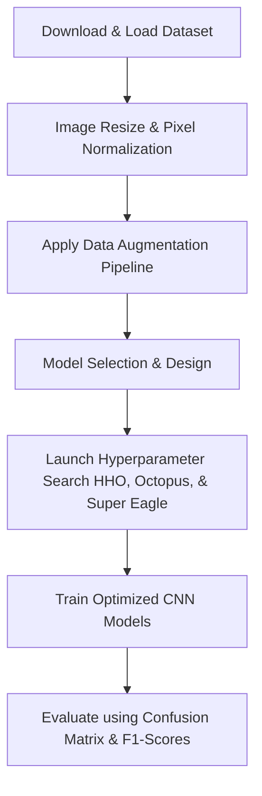

# 📌 ECG Image Classification using CNN & Metaheuristic Optimization

[](https://www.python.org/)
[](https://www.tensorflow.org/)
[](https://keras.io/)
[](https://opencv.org/)
[](https://jupyter.org/)

An advanced machine learning pipeline designed to classify **Electrocardiogram (ECG) Images** into distinct cardiac diagnostic categories. This project leverages a custom **Convolutional Neural Network (CNN)** and enhances hyperparameter selection through metaheuristic optimization algorithms implemented from scratch: **Harris Hawks Optimization (HHO)**, **Octopus Optimizer**, and the **Super Eagle Optimizer**.

---

## 🚀 Key Features

*   **📊 Multi-Class Cardiac Diagnosis:** Classifies ECG images into 4 distinct categories representing patient heartbeat statuses.
*   **🖼️ Robust Image Preprocessing:** Implements custom image cleaning, resizing, and pixel normalization using **OpenCV**.
*   **🔄 Advanced Data Augmentation:** Utilizes flips, rotation, scaling, and Gaussian blur to expand training samples by **700%+**, combating class imbalance and preventing overfitting.
*   **🐙 Metaheuristic Optimization:** Custom Python algorithms for **Harris Hawks Optimization (HHO)**, **Octopus Optimizer**, and the **Super Eagle Optimizer** to search and tune learning rates, network filter capacities, and dropouts.
*   **📈 Thorough Performance Metrics:** Full training curves, confusion matrices, and detailed classification reports (precision, recall, f1-score).

---

## 📂 Dataset Details

The dataset contains diagnostic images of ECG graphs categorized into class folders representing patient conditions. Due to GitHub file size limitations, the dataset is hosted externally.

*   **📥 Download Dataset Link:** [ECG_DATA.zip (Google Drive)](https://drive.google.com/file/d/1MwigK7mg9P_gDQ_aZIzXkBexrueW2I72/view?usp=drive_link)

### 📁 Directory Structure
ECG_DATA/
├── Normal Person ECG Images/
├── ECG Images of Patient that have History of MI/
├── ECG Images of Patient that have abnormal heartbeat/
└── ECG Images of Myocardial Infarction Patients/
```

---

## ⚙️ Tech Stack & Dependencies

The project relies on standard data science and computer vision libraries:

*   **Core Logic:** `Python`
*   **Deep Learning:** `TensorFlow`, `Keras`
*   **Computer Vision & Data Processing:** `OpenCV`, `NumPy`
*   **Machine Learning Metrics:** `Scikit-learn`
*   **Data Visualization:** `Matplotlib`, `Seaborn`

---

## 📈 Model Performance & Results

The hyperparameter optimization runs systematically evaluated different configuration sets. The comparison of classification accuracy across models is detailed below:

| 🧠 Model Configuration | 🎯 Accuracy |
| :--- | :---: |
| **CNN + Super Eagle Optimizer** | **96.24%** |
| **Baseline CNN** (Manual Tuning) | **93.55%** |
| **CNN + Harris Hawks Optimization (HHO)** | **93.55%** |
| **CNN + Octopus Optimizer** | **90.86%** |

---

## 🔄 Project Workflow



---

## ▶️ Getting Started

### 1️⃣ Clone the Repository
```bash
git clone https://github.com/your-username/Ecg_project_git.git
cd Ecg_project_git
```

### 2️⃣ Download and Place the Dataset
1. Download the `ECG_DATA.zip` from [Google Drive Link](https://drive.google.com/file/d/1MwigK7mg9P_gDQ_aZIzXkBexrueW2I72/view?usp=drive_link).
2. Extract the folder into your project root directory or upload it to your Google Drive to run on Google Colab (as referenced in the notebook).

### 3️⃣ Install Dependencies
Ensure you have Python 3.9+ installed. Run:
```bash
pip install -r requirements.txt
```

### 4️⃣ Run the Notebook
Open and run all cells in the Jupyter notebook:
```bash
jupyter notebook Project.ipynb
```

---

## 🤝 Contributing
Contributions, issues, and feature requests are welcome! Feel free to check the issues page or submit pull requests to improve the optimization algorithms.
